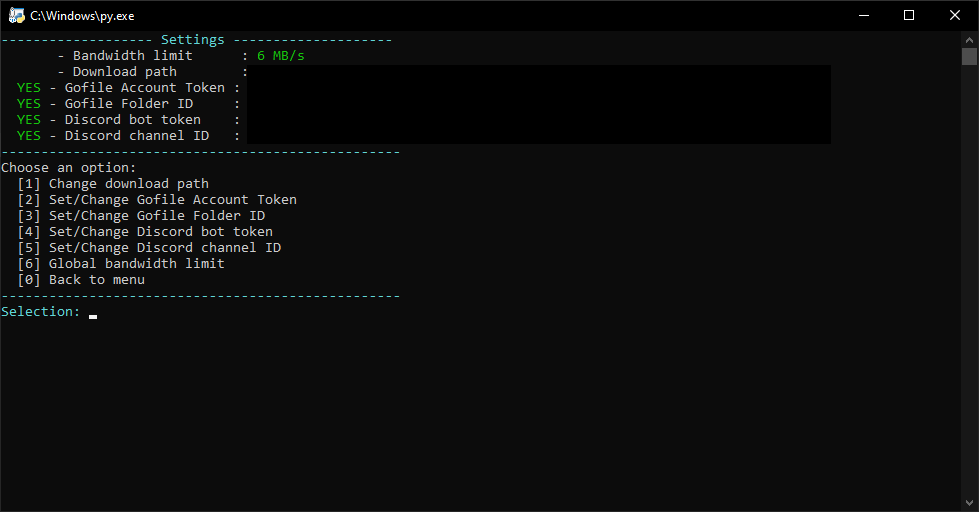
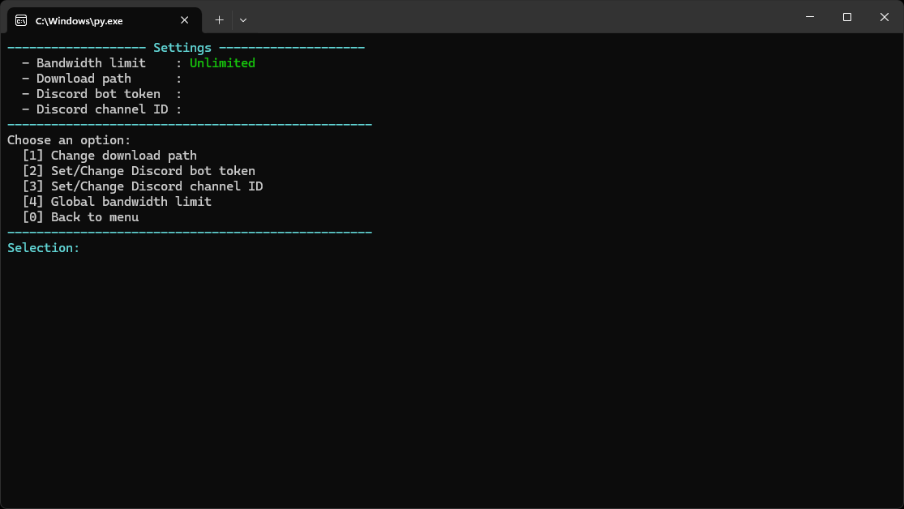

  <pre style="white-space:pre-wrap; text-align:center; display:inline-block; max-width:95%; overflow:auto; line-height:1; font-family:monospace; margin:0 0 16px 0;">                                                                                            
 _|    _|  _|      _|  _|_|_|  _|      _|  _|_|_|_|  _|_|_|      _|_|_|    _|_|    _|        
 _|    _|  _|_|    _|    _|    _|      _|  _|        _|    _|  _|        _|    _|  _|        
 _|    _|  _|  _|  _|    _|    _|      _|  _|_|_|    _|_|_|      _|_|    _|_|_|_|  _|        
 _|    _|  _|    _|_|    _|      _|  _|    _|        _|    _|        _|  _|    _|  _|        
   _|_|    _|      _|  _|_|_|      _|      _|_|_|_|  _|    _|  _|_|_|    _|    _|  _|_|_|_|  
                                                                                                                                                                                                  
  </pre>

  
<strong>Screenshots</strong>

 
  

    
  

  

    
  

  

## Features 🚀

- **Video Download:** The tool can download videos from any website supported by yt-dlp.
- **Gofile Upload:** Automatically upload videos to your Gofile Folder. (it will take longer)
- **Flexible Input:** You can manually enter links, import them from a `.txt` file, or retrieve them via a Discord channel.
- **Secure Configuration:** All settings are securely saved in the `config.json` file.
- **Daily Download Statistics:** The tool records how many videos were downloaded today and the total combined size, resetting at local midnight (supports all time zones).
- **Update Check:** When launched, the tool uses the GitHub API to check whether there is a new commit **specifically** for `universal.py`
- **Download Speed:** You can set a maximum download speed, 0 means unlimited.

---

## Prerequisites 🛠️

- **Python**: You need Python 3.9 or higher to run the script.
- you need always the newest version of [yt-dlp](https://github.com/yt-dlp/yt-dlp)
- **FFmpeg**: This is required for converting video formats.  
  A warning will be displayed if it is not found.  
  It is highly recommended to download FFmpeg [here](https://ffmpeg.org/download.html) or place the `ffmpeg` file in the same folder as the script.

- **Required Python Libraries**: The script will automatically install all necessary libraries upon the first run. These include:
  - [aiohttp](https://docs.aiohttp.org/) 
  - [cloudscraper](https://github.com/VeNoMouS/cloudscraper)  
  - [yt-dlp](https://github.com/yt-dlp/yt-dlp)
  - [requests](https://github.com/psf/requests) 
  - [discord.py](https://github.com/Rapptz/discord.py)
  
  The tool uses these libraries to perform its core functions. I accept no responsibility for any problems that may arise from their use.

---

## Setup and Configuration ⚙️

All settings are saved in the `config.json` file, which is automatically created on the first run of the script. Here are the key options:

- **download_path**: The save path for downloaded videos. If left empty, you will be prompted to enter a path on the first run.  
- **gofile_Account Token**: Your personal Account Token for Gofile.  
- **gofile_folder_id**: The ID of the destination folder in your Gofile account.  
- **discord_bot_token**: Your Discord bot's token.  
- **discord_channel_id**: The ID of the Discord channel from which links should be read.  

## How to Obtain the Required Information

### 1. Gofile Account Token & Folder ID

- **Account Token**: Log in to gofile and scroll down to the bottom of My Profile. 
- **Folder ID**: my files, then the three dots of the respective folder, then properties.
  
### 2. Discord Bot Token & Channel ID

For the Discord integration, you will need to create a bot that can read messages.

#### Bot Creation:

1. Go to the [Discord Developer Portal](https://discord.com/developers/applications).  
2. Click on **"New Application"** and give your application a name.  
3. Navigate to **"Bot"** in the left menu and click on **"Add Bot"**.  
4. Under **Privileged Gateway Intents**, you must enable the **"Message Content Intent"** so the bot can read messages, And of course you have to add the bot to your server.

#### Bot Token:

- Your bot token will be displayed in the **"Bot"** section under the bot's username.  
- Click on **"Reset Token"** and then **"Copy"** to copy it.  
- ⚠️ **Warning**: Never share this token.  

#### Channel ID:

1. Open Discord and go to **User Settings > Advanced**. Enable **Developer Mode** there.  
2. Right-click on the channel you want to retrieve links from and select **"Copy Channel ID"**.

---

## Using Cookies for Restricted Videos 🍪

This tool can use cookies to download restricted videos, By providing a `cookies.txt` file, The tool will automatically look for this file in the same folder where the `universal.py` script is located.

### How to Export Your Cookies

The easiest way to get your cookies is by using a browser extension like **Cookies Editor** for Chrome, Firefox, Brave, Safari or Opera.

1. **Navigate to the Website**:  
   Go to the website you want to download from (e.g., YouTube, a social media site, etc.) and make sure you are logged in.

2. **Open the Extension**:  
   Click on the **Cookies Editor** icon in your browser's toolbar.

3. **Export as Netscape**:  
   In the bottom right corner of the extension's window, look for an **Export** button.  
   Click it and select the **Netscape** format.  
   This will copy the cookie data to your clipboard.

4. **Create and Paste**:  
   - In the same folder as your `universal.py` script, create a new text file and name it `cookies.txt`.  
   - Open this new `cookies.txt` file and paste the copied Netscape cookie data into it.  

5. **Save the File**:  
   If you encounter problems downloading, re-enter the cookies in `cookies.txt` and make sure you are logged in on those websites you want to download videos from. 
   Save and close the `cookies.txt` file.  

That’s it! The next time you run the tool, it will automatically detect and use the cookies for your downloads.

---

  
### Important Note on Privacy 🔒
The cookies are processed **locally on your computer**.  
The tool does **not** store, share, or transfer your cookie data.  
It only uses them to download age-restricted videos.

